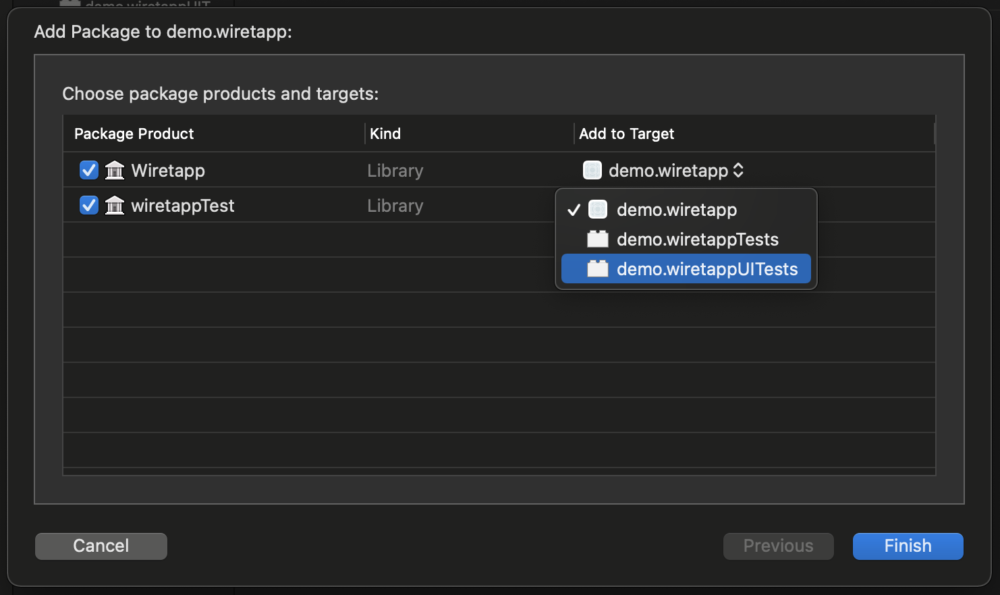
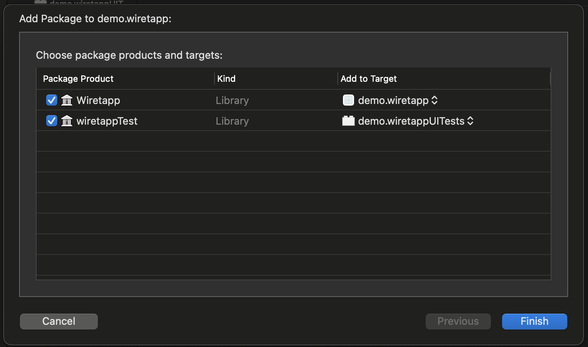
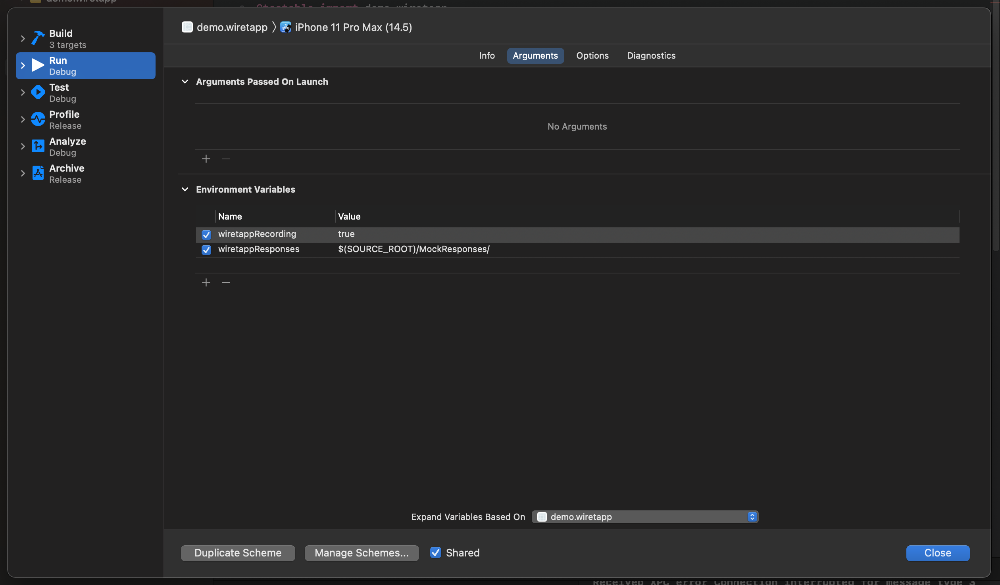

# Wiretapp

A framework to make writing UI tests a breeze!

- Allows you to record and serve up canned responses! 🥫
- No reliance on a server; making the UI tests deterministic and run super fast! 🏃‍♂️🚀
- Allows for serving up mocks curated to the test case scenario currently running! 👩‍🍳
- Enables running tests in parallel speeding up pipeline runs without any extra affort! 👯‍♀️

# How do you setup Wiretapp?

1. Add `Wiretapp` as a swift package to your project and in the target modal add `Wiretapp` to your app target and `wiretappTest` to your UI Test target

 

2. Next, click on the scheme drop down and select `Edit Scheme` for your main app target
3. In the `Environment Variables` add the following variables
    - `wiretappResponses` with the path set to where you want the mock responses to be stored and read from (eg; `$(SOURCE_ROOT)/MockResponses/`)
    - `wiretappRecording` with the value set to `true` or `false`, which signifies wether record mode is turned on or off (can also be set to `true` and the variable can be checked/unchecked instead)

 

4. Add the `MockResponses` folder to your project as a `reference folder` (blue folder icon)
    - Do `Add Files to [project]`, selecting the folder you want to add and making sure the `Create folder references` radio button is checked 

And thats it, you're all set! 🎉🥳

# How to use Wiretapp?

1. In your app code
    - Import `Wiretapp`
    - call `Wiretapp.registerSharedSession()` (`Wiretapp.register(configuration:)` if you're using a custom implementation of `URLSession` or `Alamofire`) <b><i>before</i></b> your app starts making Network requests
2. Run your app through the scenario you'll be writing the UI test for
    - You should start seeing the JSON responses start appearing under the `recorded` folder 🤗

 

3. In your UITest target
    - Import `WiretappTest`
    - Inherit your XCUITest with `WiretappBaseTestCase`
4. Drag and drop the responses inside your `-recorded` folder under a new directory structure inside `MockResponses` a directory named according to your test scenario
    - Example for a test case `test_LoginSuccessful` inside `LoginTests`, the directory would be `MockResponses/LoginTests/LoginSuccessful`

Run the test case and it should be running off of the mock JSON responses inside the mock responses folder! 🍾

You can tweak the `status` code and modify the `response` data in the JSON files to simulate different scenarios ( error cases ie. 404 / 400 / etc ) for your tests!